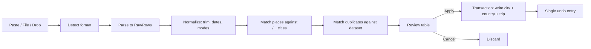
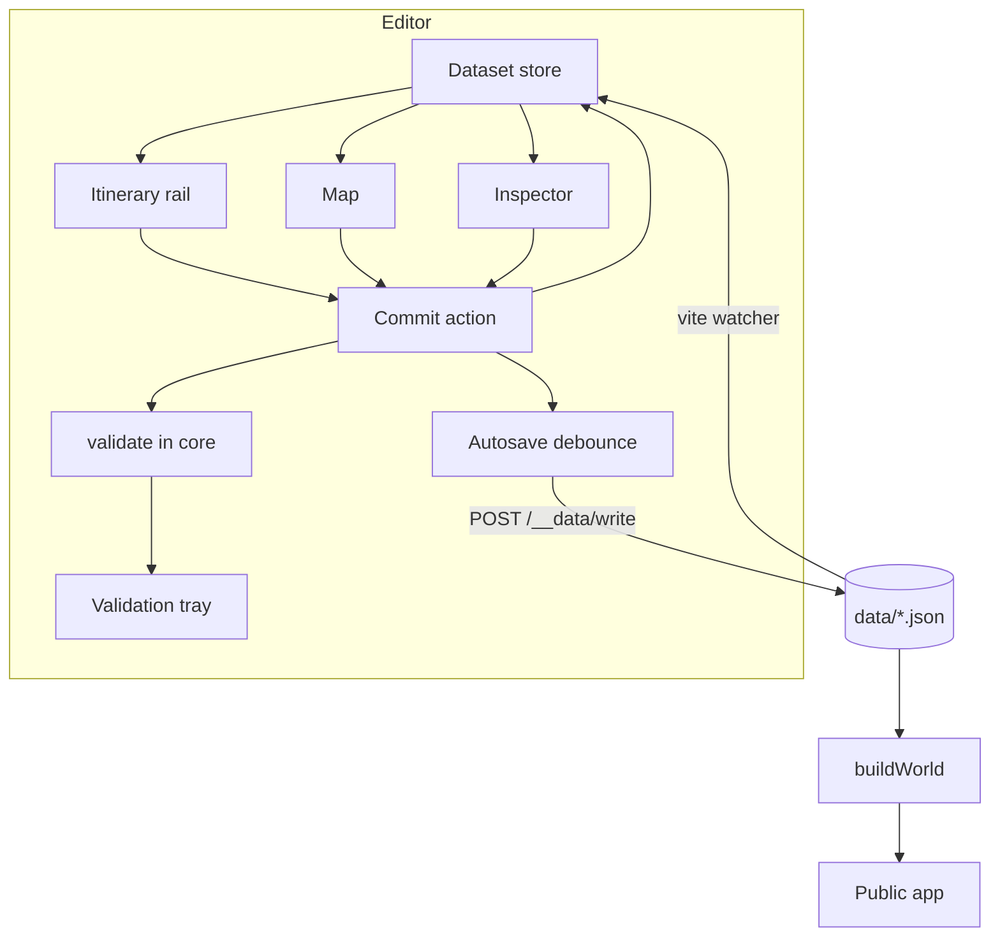
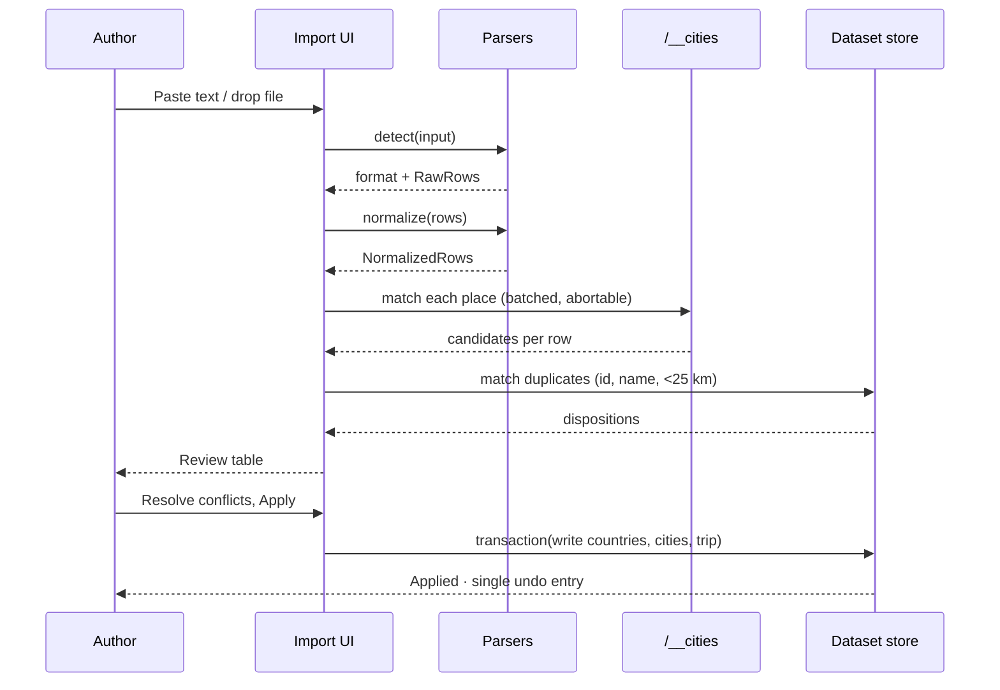

# Travel Map Editor Redesign

Grounded in the repository at commit `c051ded5` (branch `global`). Every claim
about current behaviour below cites a real file. Where this document proposes
something new it says so explicitly.

---

## 1. Executive concept

### Core product concept

**The trip is the only document the author should have to think about.**

Everything else in `data/` — countries, cities, the site config's city-role
lists — exists solely because a trip needed it. The repository already admits
this in `CreateScreen.tsx:33-38`:

> "Countries are not among them: one appears automatically with the first city
> placed inside it, which is the only reason a country document needs to exist."

The current editor states that principle for countries and then abandons it for
everything else. Cities are a separate top-level create flow, a separate
sidebar section, and a separate screen. A trip step cannot reference a city that
does not already exist as a document, so the actual authoring sequence is:
*think of a place → leave the trip → create a city → return to the trip → find
the city in a combobox*. The redesign collapses that into: *type the place name
into the itinerary*.

### Main user promise

> Type where you went. The map, the dates, the distances, the country files and
> the city files take care of themselves — and you can see and undo every single
> thing the editor decided for you.

### Why the current mental model should change

The current editor is a **file browser with forms attached**. Its information
architecture is a one-to-one mirror of the `data/` directory layout
(`Nav.tsx:49-79` builds sidebar sections literally named `country`, `city`,
`trip`; `App.tsx:153-164` routes `/countries/:id`, `/cities/:id`, `/trips/:id`).
That is the *storage* model, not the *task* model. The task is "record a trip".

The cost of that mismatch is visible in the repository's own shipped data.
`data/trips/cagliari-2026.json` contains three identical steps:

```json
{ "type": "transport", "fromId": "Cagliari", "mode": "train", "toId": "Cagliari" }
```

That is not a typo — it is the literal default produced by
`TripScreen.tsx:270-283`, which appends a transport step with
`fromId: firstCityId, toId: firstCityId, mode: "train"`. The document is
structurally valid, `buildWorld` accepts it, `reviewDataset` does not flag it,
and it renders as three meaningless zero-length train journeys on the public
map. **A default that produces silently-wrong output is the single strongest
argument that the editing model, not the styling, is what needs replacing.**

### Proposed editing model

A **persistent trip workspace**: one screen, three synchronized panes
(itinerary rail, map, inspector), no navigation between documents to complete a
single task. Cities and countries are created *inline as a consequence of
adding a stop*, exactly the way `ensureCountry()` (`CreateScreen.tsx:81-92`)
already creates a country when you add the first city inside it — that function
is the right idea applied one level too high in the tree.

Transport legs stop being things you add. **Consecutive stops imply a leg.** The
editor materializes the leg, derives `fromId`/`toId` from the neighbours,
derives `distanceInKm` with the haversine already sitting unused in
`packages/core/src/world/distance.ts`, and asks the author for exactly one
thing: the mode. The Cagliari bug becomes unrepresentable.

### Expected improvement in ease of use

| Task | Today | Proposed |
| --- | --- | --- |
| Add a stop in a city not yet in the dataset | Leave trip → `/new/city` → gazetteer search → name → id → create → **full page reload** → navigate back to trip → open combobox → find city → add stop → add transport → set from → set to → set mode | Type place name in the rail → pick from gazetteer → done (city + country files written in the background) |
| Correct a wrong itinerary order | ↑/↓ one position per click (`TripScreen.tsx:126-135`) | Drag, or ↑/↓, or cut/paste, or "sort by date" |
| Know a step is wrong | Not detected; `reviewDataset()` runs once at module load (`App.tsx:24`) and never re-runs while editing | Live, inline, on the map, and in a validation tray |
| Undo a mistake | Reload the page and lose everything else too | Ctrl+Z, unlimited within session |
| Save | Click Save; page reloads on structural changes (`dataset.ts:233`) | Autosaves; never reloads |

---

## 2. Current-state diagnosis

### What the editor currently creates and edits

Four JSON document kinds under `data/`, all bundled through
`import.meta.glob(..., { eager: true })` in `apps/travel-map-editor/src/core/dataset.ts:105-125`:

| Kind | Path | Schema | Editor screen |
| --- | --- | --- | --- |
| Site config | `site.config.json` | `SiteConfig` (`dataset.ts:43-66`) | `ConfigScreen` |
| Country | `<Id>/<Id>.json` | `CountryJson` (`packages/core/src/schema/index.ts:17`) | `CountryScreen` |
| City | `<CountryId>/<Id>/<Id>.json` | `CityJson` (`schema/index.ts:42`) | `CityScreen` |
| Trip | `trips/<id>.json` | `TripJson` (`schema/index.ts:132`) | `TripScreen` |
| Photo manifest | `photos/<Country>/<City>/<name>.json` | `Image[]` | **None — read-only, referenced by path** |

Photo manifests are produced out of band by `scripts/uploader/main.py`, which
converts media to WEBP, uploads to BunnyCDN, and exports
`[{alt, width, height, thumbnail, original}]`. The editor only offers the
existing manifest keys as combobox options (`StepFields.tsx:71-79`). This is a
real boundary and the redesign keeps it.

### Mandatory fields (from the type definitions, not from UI)

- `CountryJson`: `id`, `name`, `color{h,s,l}`, `continent`, `currency`
- `CityJson`: `id`, `name`, `countryId`, `coordinates` (`[lng, lat]`), `timeZone`
- `TripJson`: `id`, `title`, `sDate`, `eDate`, `originCityId`, `returnCityId`, `steps`
- `TripStopJson`: `type`, `cityId`, `sDate`, `eDate`
- `TripTransportJson`: `type`, `mode`, `fromId`, `toId`

Everything else is optional.

### How the public app consumes the output

1. `apps/travel-map/src/data/index.ts` eagerly globs the same JSON.
2. `packages/core/src/world/buildWorld.ts` resolves every id reference and
   instantiates `Country`, `City`, `Trip`. `requireReference()` **throws** on an
   unresolved id (`buildWorld.ts:55-63`) — a bad reference is a hard build/boot
   failure, not a degraded render.
3. `apps/travel-map/src/data/world.ts` calls `buildWorld()` once and exports
   module-level constants.

Derived automatically by the app already, and therefore things the editor must
**not** ask for: `Trip.getDurationInDays()`, `getCountriesVisited()`,
`getCityTravels()`, `getFlights()`, `getFerries()`, `getRouteSegments()`,
`getRouteLines()` (`packages/core/src/classes/Trip.ts`), and
`getCitiesDistance()` (haversine, `world/distance.ts`).

Consumed but authored by hand: `mapFocus` (`Map.tsx:97-101`), `coverImage`
(prefixed with `VITE_CDN_PATH` in `Trip.ts:217`).

### External services

There is **no runtime network dependency**. Everything external is dev-server
side or out of band:

| Service | Where | Nature |
| --- | --- | --- |
| `all-the-cities` gazetteer | `vite/cityIndex.ts:54-64`, filtered to population ≥ 5 000 | Node-only, served at `/__cities` |
| `tz-lookup` | same plugin | Node-only, served at `/__cities/timezone` |
| `world-countries` | `src/core/world.ts` | Flags, continent, currency, translations |
| Google Maps paste | `src/core/geo.ts` | **Regex only, no network.** Short `maps.app.goo.gl` links deliberately fail rather than guess |
| BunnyCDN | `scripts/uploader/main.py` | Out of band, Python |

**There is no geocoding API, no routing API, no directions API, and no
backend.** Any proposal that assumes one is proposing a new dependency, and
this document flags every such case.

### Real technical constraints (preserve these)

1. **Localhost-only, dev-server-mediated writes.** `dataWriter.ts:88-133`
   exposes `/__data/write` and `/__data/delete` as `apply: "serve"` Vite
   middleware. `resolveDataPath()` jails writes to `data/` and to `.json`.
   Output format is fixed: `JSON.stringify(value, null, 2)` + `\n`.
2. **No auth, no multi-user, no server.** Conflict handling between "users" is
   not a real requirement. Conflict handling between *the editor and git* is.
3. **`id` is a filesystem path segment and a URL segment.** `ID_PATTERN`
   (`dataset.ts:267`) allows `[A-Za-z0-9][A-Za-z0-9_-]*` because city ids become
   gallery URL segments and every id becomes a directory name.
4. **A city's file path embeds its `countryId`.** Changing a city's country is a
   file move: write new, delete old (`CityScreen.tsx:81-88`).
5. **A fresh fork has no `data/` at all.** `DEFAULT_CONFIG` (`dataset.ts:72-89`)
   exists precisely for that. The empty state is the *first* state, not an edge
   case.
6. **Photo manifests are generated, never authored here.**
7. **`buildWorld` throws on dangling references** — deleting a city that a trip
   references breaks the whole public app, not one page. `CityScreen.tsx:102`
   already withholds delete when dependents exist; that guard must survive.
8. **`data/` is gitignored.** `.gitignore` excludes `/data/` outright, with the
   comment "the repo ships with an empty `data/` so a fork starts from
   scratch". **Authored content is therefore not under version control**, which
   removes the safety net most of this document's recovery and publishing
   reasoning was leaning on. Every place below that assumed otherwise is
   corrected, and §22 gains a first-class deliverable: the editor must own
   backup and recovery itself, because nothing else does.

### Accidental constraints (discard these)

1. **The full-page reload after every create/delete.** `reloadAt()`
   (`dataset.ts:233`) navigates the document because Vite's eager globs are
   captured at module evaluation. But `dataWriter.ts:103` already calls
   `server.watcher.add(dataRoot)`. The dataset can be an observable in-memory
   store updated on write and reconciled from HMR/watch events. **This one
   change unlocks autosave, undo, and live validation**, none of which are
   possible while every structural edit nukes the page.
2. **Save-on-submit only.** `EditorForm.tsx:163-172` disables the button unless
   `isDirty`, blocks on `problems`, and installs a `beforeunload` guard
   (`EditorForm.tsx:43-57`) to compensate for the reload. All three disappear
   with autosave.
3. **Module-scope one-shot validation.** `App.tsx:24` runs
   `reviewDataset()` exactly once per document load. While you edit, the problem
   count in the nav is stale by construction.
4. **Three disconnected validators.** `requireReference` (core, throws),
   `tripDateErrors` (`dataset.ts:288`, strings), `reviewDataset`
   (`validation.ts:19`, strings), plus per-screen ad-hoc `problems` arrays
   (`TripScreen.tsx:89-93`, `CityScreen.tsx:72-75`, `CreateScreen.tsx:113-118`).
   None share a model; messages are untranslated English in `dataset.ts` and
   translated in the screens.
5. **No map on the trip screen.** The product is a map. Its itinerary editor is
   a stack of comboboxes. `CoordinatePicker` proves the map component already
   works inside the editor and shares the app's real theme
   (`CoordinatePicker.tsx:45-46`).
6. **Transport steps as first-class user-created objects**, with the
   same-city default described in §1.
7. **Manual `distanceInKm` and `durationMinutes` number fields**
   (`StepFields.tsx:159-171`) when `getCitiesDistance()` exists in core.
8. **Reordering by ↑/↓ only**, one position per click.
9. **Fields unreachable from the UI.** Grep confirms the editor never mentions
   `mapFocus`, `customMarkerSizes`, `rowConstraints`, or `targetRowHeight`.
   Authors must hand-edit JSON for the map viewport of their own trip.
10. **A broken first-run link.** `Overview.tsx:65` links to `/new/country`, but
    `CREATE_KINDS = ["city", "trip"]` (`App.tsx:25`), so `CreateRoute` renders
    `MissingDocument`. **The very first instruction shown to a new fork is a
    dead link.**
11. **Atomic-design folders** (`components/atoms|molecules|organisms|pages`)
    while the public app has already migrated to `features/`.
    `CODING_GUIDELINES.md` §20 explicitly lists auditing the editor as pending
    work; this redesign is the trigger.

### Confusing terminology

| Current term | Problem | Proposed |
| --- | --- | --- |
| "Step" | Covers both "I stayed in Rome for 3 days" and "I took a train" | **Stop** and **Leg** |
| "Photo manifest" | Implementation detail of the Python uploader | **Gallery** |
| "Layover" | Reasonable, but buried in a checkbox below the fold | Stop *type* toggle: Stay / Layover |
| "Origin" / "Return to" | Reads as trip metadata, but is really "where the trip begins and ends" and is separate from step 1 | Derived from the itinerary, overridable |
| "Canonical name" vs `nameByLocale` | Correct but unexplained | **Display name** + **Translations** |
| "Min marker scale" | Rendering internal exposed as a raw number | **Marker size** with a live preview |

### Preserve only for compatibility

- `originCityId` / `returnCityId` as *stored* fields (the app reads them), but
  **derive them** from the first and last stop with an override.
- `distanceInKm` / `durationMinutes` on transport steps as stored fields, but
  populate them from derivation and mark authored overrides.
- The `photoPath` string key into the uploader's output.
- Two-space JSON with a trailing newline (git diff hygiene).

### Discard

The atomic-design folder tree, `EditorForm`'s save/dirty/beforeunload
machinery, `reloadAt`, `CreateScreen` as a separate destination, the
document-mirroring sidebar, `tripDateErrors`' string-array validation, the
one-shot `reviewDataset` module-scope call, the ↑/↓-only reordering, and the
`/new/country` route reference.

---

## 3. User types and jobs to be done

The repository's own framing matters here: `data/README.md` and the workspace
split exist so **other people fork this template**. The memory of the project
records that `data/` will eventually not ship — so the "empty dataset" user is
not hypothetical, they are the modal new user.

| User | Job | Main pain today |
| --- | --- | --- |
| **Forker (first run, empty `data/`)** | "Get *something* on the map so I know it works" | The welcome screen's first link is dead (`/new/country`). Nothing explains that a trip needs a city which needs a country. |
| **The maintainer, back from a trip** | "Record 14 days, 6 cities, 9 legs, before I forget" | ~60 combobox interactions and 6 page reloads for a two-week trip. Transport defaults are wrong and silent. |
| **Frequent traveller (power user)** | "Same shape as last time, different places" | No duplicate, no template, no bulk edit, no keyboard path, no paste. |
| **Content maintainer** | "Attach this year's galleries and cover images" | `photoPath` is a raw key; `coverImage` is a free-text path with no validation and no preview. |
| **Importer** | "I already have this in Google Maps / a spreadsheet / a GPX file" | Only a single Google Maps link → single coordinate (`geo.ts`), used on the city screen only. |
| **Fixer** | "Something is wrong on the live site" | `reviewDataset` reports it in prose on the overview, unlinked to the thing that is wrong. |

---

## 4. New information architecture

Two top-level surfaces, not seven.

```
Editor
├─ Library            (all trips + dataset health; the home screen)
└─ Trip workspace     (everything needed to author one trip)
   ├─ Itinerary rail  (stops, legs, days)
   ├─ Map             (the same MapLibre style the public site uses)
   ├─ Inspector       (whatever is selected: trip / stop / leg / city / day)
   └─ Trays           (Validation · Changes · Appearance · Preview)
Settings              (site config; visited rarely, deliberately out of the way)
```

**Why not "Overview / Itinerary / Map / Content / Appearance / Preview /
Publish" as separate sections:** every one of those is a *view onto the same
trip*, and the prompt's own rule — "avoid forcing the user to switch repeatedly
between unrelated screens" — argues against turning them into destinations. They
become panes and trays within one workspace.

### What belongs where

**Library** — every trip as a card with its date range, city count, cover
image, and validation status; "New trip"; dataset health (the useful part of
today's `Overview`); and a link to Settings. Cities and countries are **not**
listed here as primary objects. They appear in a collapsible "Places" section
for the rare direct-edit case (renaming a city, fixing coordinates), reachable
also from any stop's inspector.

**Trip workspace / Itinerary rail** — the ordered truth of the trip: day
headers, stops, legs, unscheduled stops. Nothing else.

**Trip workspace / Map** — geography and route. Markers for stops, lines for
legs, validation badges in place. Also where `mapFocus` is set — by framing the
map and clicking "Use this view", which is the only humane way to author a
`{center, zoom}` pair.

**Trip workspace / Inspector** — fields for the current selection only. This is
where progressive disclosure lives: a stop shows city, dates, gallery; "More"
reveals layover, `rowConstraints`, `targetRowHeight`.

**Trays** (bottom, collapsible, never modal):
- *Validation* — every issue, grouped, each one selecting its subject on click.
- *Changes* — which files on disk this session has written, with a diff. This
  replaces the "publish" concept (see §6).
- *Appearance* — country colour, marker scales, cover image, map focus.
- *Preview* — the public app's own rendering at desktop/tablet/mobile widths.

**Settings** — `site.config.json`: site metadata, locales, home/lived/future
city roles, map defaults, companies, UNESCO lists. Rarely touched, so it is a
separate route, not a tray.

**What must NOT be in the trip workspace:** site config, the country list, the
photo-upload pipeline (it is Python and out of band — link to the README, do not
fake a UI for it).

---

## 5. Primary workflows

### 5.1 Create a simple trip from scratch

- **Entry point:** Library → "New trip", or `N` from anywhere.
- **User actions:** Type a title. Type the first place name. Pick it from the
  gazetteer list. Set arrival/departure. Repeat for each place.
- **System automation:** Generates `id` from title + start year (today's
  `derivedId`, `CreateScreen.tsx:274-276`, is already right). Writes the trip
  file immediately as a draft with zero steps. On each place pick: resolves
  country via `world-countries`, writes `<Country>/<Country>.json` if absent
  with a hue-spaced colour (`nextCountryColor()`), writes
  `<Country>/<City>/<City>.json` with coordinates, timezone and population from
  the gazetteer, inserts the stop, **inserts a leg** from the previous stop with
  derived `fromId`/`toId` and haversine `distanceInKm`, extends the trip's
  `sDate`/`eDate` to cover all stops, sets `originCityId`/`returnCityId` from
  first/last stop, and fits the map.
- **Validation:** Live. First stop with no dates → warning, not a block. Leg
  with no mode → warning with a one-click "Guess" (see §9).
- **Success state:** "Saved" in the header with a relative timestamp; the
  Changes tray lists each written file.
- **Error states:** A write failure (disk permissions, dev server restarted)
  surfaces as a persistent header banner "Not saving — retry" with a Retry
  button, and the in-memory draft is preserved. Gazetteer offline (`/__cities`
  500) → falls back to "Add place manually" with map click + coordinate fields,
  the current `CoordinatePicker` flow.

### 5.2 Paste a written itinerary → draft

- **Entry point:** Library → New trip → "Paste itinerary", or `Ctrl+V` into an
  empty rail.
- **User actions:** Paste free text. Review the parsed table. Fix any
  ambiguous rows. Apply.
- **System automation:** Line-based parsing first, no AI required:
  strip bullets/numbering, split on `→`/`-`/`,`, detect ISO and common date
  formats, detect mode keywords (`flight`, `train`, `ferry`, `drive`), then run
  each place through `/__cities`. Ambiguities (multiple gazetteer matches within
  the same score band) are surfaced, never auto-resolved.
- **Validation:** Every row shows one of: **matched** (city name + country flag +
  population), **ambiguous** (choose), **unmatched** (search manually or place
  on the map).
- **Success state:** Apply creates the trip and all needed city/country files in
  one undoable transaction.
- **Error/recovery:** Partial application is allowed — unmatched rows land in an
  "Unscheduled" section of the rail rather than blocking the import. A single
  Undo reverts the entire import including the files it created.

### 5.3 Import structured trip data

- **Entry point:** Library → Import, or drop a file onto the window.
- **Formats:** `TripJson` (native), CSV of places, GeoJSON points/LineString,
  GPX, KML. See §19 for the pipeline and §11 for which of these to actually
  build first.
- **System automation:** Format detection by content sniff, not extension.
  Normalization to the canonical draft model. Duplicate matching against
  existing cities by id, then by name, then by coordinate proximity (< 25 km).
- **Validation:** A review table with per-row disposition: **create**,
  **reuse existing city**, **conflict — choose**.
- **Success state:** Diff-before-apply, then apply as one undo entry.
- **Error/recovery:** Malformed input never partially writes; parse failures
  report line/row numbers.

### 5.4 Add and organize places

- **Entry point:** Rail "+" button, map click, `Ctrl+K` command palette, or
  paste.
- **User actions:** Search/click/paste; drag to reorder; multi-select with
  Shift/Cmd; group into days.
- **System automation:** On reorder, adjacent legs are re-derived (`fromId`,
  `toId`, distance) while **authored** fields (mode, flight number, company,
  manual duration) stay attached to the leg. Day grouping is computed from stop
  dates; undated stops stay in "Unscheduled".
- **Validation:** Overlapping stop date ranges, a stop that ends before it
  starts, a leg whose endpoints don't match its neighbours, duplicate city in
  consecutive stops.
- **Success state:** Rail, map, and inspector update together; autosave fires.
- **Error/recovery:** Every structural change is one undo entry.

### 5.5 Fix route or date conflicts

- **Entry point:** Validation tray, an inline badge in the rail, or a badge on
  the map.
- **User actions:** Click the issue → its subject is selected across all three
  panes → apply the suggested fix or edit by hand.
- **System automation:** Each issue carries an optional `fix` describing a
  concrete mutation ("Set leg 3 arrival to 12 Aug", "Extend trip end to 14 Aug").
- **Validation:** Re-runs on the next state commit; issues that disappear
  animate out (or don't, under `prefers-reduced-motion`).
- **Success state:** Issue count decrements; the tray shows "No blocking
  issues".
- **Error/recovery:** Applying a fix is undoable like any other edit.

### 5.6 Style the map

- **Entry point:** Appearance tray.
- **User actions:** Adjust country colour (HSL wheel, live on the map), marker
  size, cover image, and map focus.
- **System automation:** "Fit to trip" computes a `{center, zoom}` from the
  stops and writes `mapFocus`. Colour suggestions avoid hues already used by
  adjacent countries — a generalization of `nextCountryColor()`.
- **Validation:** Contrast check for country fill against the land tone; warn
  when two bordering countries are within a small hue distance.
- **Success state:** The map pane *is* the preview; there is nothing to confirm.
- **Error/recovery:** "Reset to suggested" per field.

### 5.7 Preview and publish

**There is no publish, and the redesign should not invent one.** There is no
server, no CMS, no draft/live split — `data/` is read at build time by
`apps/travel-map`. Publishing is whatever gets the built site deployed.

**Correction (verified against `.gitignore`):** `/data/` is gitignored, so
publishing is *not* `git commit`. The author's content never enters this
repository's history at all — it exists only in their working tree and in
whatever they build from it. That makes the checklist below more important, not
less, and it makes "export a backup" a required feature rather than a
convenience (§22).

So this flow is honest:

- **Entry point:** Changes tray.
- **User actions:** Read the pre-commit checklist. Open Preview to see the
  public app render the trip at three widths. Copy the suggested commit message.
- **System automation:** Checklist = the blocking issues from §18 plus
  "referenced gallery exists", "cover image path shaped like `/Trips/…`", "every
  city used by a trip has coordinates".
- **Validation:** Blocking issues are the ones that would make `buildWorld`
  throw. Everything else is advisory and does not gate anything.
- **Success state:** "Ready to commit — 4 files changed."
- **Error/recovery:** Git is the version history (§8, §15). The editor does not
  duplicate it.

### 5.8 Edit an already published trip

Identical to editing any trip — there is no state machine to traverse. The
difference is informational: the Changes tray shows the working-tree diff
against `HEAD`, so the author can see what they are about to alter on the live
site. Optional: a `/__git/status` dev-server endpoint (same `apply: "serve"`
pattern as `dataWriter`) reading `git status --porcelain`.

### 5.9 Recover from mistakes

Four independent layers, weakest to strongest:

1. **Undo/redo** — in-session, unlimited, `Ctrl+Z` / `Ctrl+Shift+Z`.
2. **Session snapshot in `localStorage`** — the last committed draft per trip,
   restored after a crash or refresh with "Restore unsaved changes?".
3. **Disk** — autosave means disk is never more than ~1 s behind.
4. ~~**Git**~~ — **does not apply.** `/data/` is gitignored, so there is no
   `git checkout` to fall back to and no history older than the current file.
   Layer 4 must instead be an **editor-owned export**: a timestamped
   `data/` snapshot the author can write on demand and before any destructive
   action. Until that exists, deleting a document is genuinely irreversible
   once the undo stack is gone — which raises, not lowers, the bar for the
   dependent-guard on deletes.

Deletion is the one irreversible action, and it keeps today's guard: a city
referenced by any trip cannot be deleted (`CityScreen.tsx:102`), extended to
*every* delete showing its dependents first.

### 5.10 Bulk edits

- **Entry point:** Multi-select in the rail (Shift-click range, Cmd-click
  toggle, `Ctrl+A` within a day).
- **Actions:** Set mode on all selected legs; shift all selected dates by ±n
  days; assign all selected stops to a day; delete; duplicate.
- **System automation:** Date shifting re-derives day grouping and extends the
  trip range.
- **Validation:** Preview shows "12 steps will change" before applying.
- **Success/recovery:** One undo entry for the whole batch.

---

## 6. Proposed editor layout

### Model: hybrid, itinerary-led, map-beside

Rejected alternatives, with reasons specific to this repository:

- **Wizard** — trips are edited repeatedly over weeks (photos arrive later,
  cover images later). A wizard optimizes the one-time path and punishes the
  repeated one.
- **Map-first (map full-bleed, itinerary as an overlay)** — the itinerary is an
  *ordered, dated* structure. Order and dates are where the real errors live
  (the Cagliari steps, overlapping ranges), and a map shows neither well.
- **Timeline-first with no map** — this is what exists today, and it is why
  `Cagliari → Cagliari` was invisible for a whole trip.
- **Canvas / freeform** — no support in the data model; `steps` is a flat
  ordered array.

**Hybrid split view** it is: the rail owns order and dates, the map owns
geography, the inspector owns detail, and all three are always visible on
desktop. The tradeoff is horizontal space; §13 handles it.

### Desktop layout (≥ 1280 px)

```
┌───────────────────────────────────────────────────────────────────────┐
│ ← Library │ Sardinia 2026 ▾ │ 2–14 Aug · 6 stops │ ✓ Saved 3s │ ⌘K │☾│
├──────────────┬──────────────────────────────────┬─────────────────────┤
│ ITINERARY    │ MAP                              │ INSPECTOR           │
│              │                                  │                     │
│ ▾ Day 1  2/8 │        ●───────────●             │ Stop · Cagliari 🇮🇹 │
│  ● Cagliari  │         ╲         ╱               │ ─────────────────── │
│  ✈ → Rome  ⚠ │          ●───────●               │ City      Cagliari  │
│ ▾ Day 2  3/8 │                                  │ Arrive    2 Aug     │
│  ● Rome      │   [Fit] [Use this view] [Style]  │ Depart    5 Aug     │
│              │                                  │ Gallery   Italy/Cag │
│ ─ Unscheduled│                                  │ ▸ More              │
│  ● Pula      │                                  │                     │
│ + Add stop   │                                  │ Open city file →    │
├──────────────┴──────────────────────────────────┴─────────────────────┤
│ ⚠ 2 warnings · 0 blocking     Validation │ Changes │ Appearance │ Prev│
└───────────────────────────────────────────────────────────────────────┘
```

- **Header:** back to Library, trip title (inline-editable), summary stats,
  **save state** (`Saved 3s ago` / `Saving…` / `Not saving — Retry`), command
  palette, theme toggle. The existing `useThemeDetector` (`App.tsx:140`) stays.
- **Global actions** live in the command palette and the header only. No
  floating action buttons.
- **Rail:** 320 px, resizable, virtualized past 200 rows (not before — §15).
- **Map:** flexible; MapLibre with the app's own `createMapStyle(theme)` and
  `countries-50m.json` topology, exactly as `CoordinatePicker.tsx:3-26` already
  does.
- **Inspector:** 360 px, form fields for the current selection.
- **Tray bar:** collapsed to a status strip; expands to 40 % height.

### Responsive behaviour

Summarized here, detailed in §13: at < 1100 px the inspector becomes a drawer;
at < 900 px the map becomes a toggleable pane; at < 700 px the rail is
full-width with a map peek sheet.

---

## 7. Screen-by-screen specification

Format per screen: **Purpose · Components · Primary action · Secondary ·
Empty · Loading · Error · Accessibility.**

### 7.1 Library (home)

- **Purpose:** Choose or create a trip; see dataset health.
- **Components:** Trip card grid (cover, title, dates, stop count, status
  badge), "New trip" primary button, dataset health panel, collapsible Places
  section, Settings link.
- **Primary:** New trip. **Secondary:** Import, Duplicate, Open Settings.
- **Empty (fresh fork, no `data/`):** A three-step guide that actually works —
  *"Create your first trip → add a place → the city and country files are
  written for you."* No link to `/new/country`; countries are never created
  directly. This replaces `Overview.tsx:52-78`, including its dead link.
- **Loading:** Not applicable — data is bundled at module load.
- **Error:** If `buildWorld` throws (dangling reference), the health panel shows
  the thrown message with a link to the offending document, and the Library
  still renders. Today the message is a bare string in a list
  (`validation.ts:39-45`).
- **A11y:** Cards are links, not click handlers. Grid is a list. Status badges
  carry text, not colour alone.

### 7.2 New-trip flow

- **Purpose:** Get from nothing to an editable trip in under 15 seconds.
- **Components:** Title field, start/end dates (optional — derivable),
  three entry choices: **Blank**, **Paste itinerary**, **Import file**, plus
  **Duplicate** from a trip picker.
- **Primary:** Create. **Secondary:** Cancel.
- **Automation:** id derived from title + year, editable via a disclosure. Date
  fields prefilled with today, and *removable* — a trip with no dates yet is
  valid in the editor and only warned about at commit time.
- **Empty/Loading/Error:** Duplicate-id is caught inline by `idError()`
  (`dataset.ts:275`, reused verbatim). Write failure keeps the dialog open with
  the message.
- **A11y:** A real `<dialog>`, focus trapped, `Escape` closes, focus restored to
  the trigger.

### 7.3 Main editor (trip workspace)

- **Purpose:** Everything in §6.
- **Primary action:** Whatever the selection implies — there is no global
  submit.
- **Empty (trip with no stops):** The rail shows one large affordance: a place
  search field with the caret already in it, plus "or click the map", plus "or
  paste an itinerary". Not an illustration with no action.
- **Loading:** Gazetteer search shows a skeleton list; the map shows the app's
  existing loading treatment.
- **Error:** A dev-server disconnect (Vite restarted) is detectable — writes
  start failing. Show a persistent, non-modal banner: *"Editor server not
  responding. Your changes are kept in this tab. Retry."*
- **A11y:** Three landmark regions (`complementary`, `main`, `complementary`),
  `F6` cycles panes, selection announced via a polite live region.

### 7.4 Location search

- **Purpose:** Turn a typed name into a city document.
- **Components:** Combobox over `/__cities` (debounced 200 ms, aborts the
  previous request — `worldCities.ts:41-59` already does this), each result
  showing name, country flag, population, timezone.
- **Primary:** Select → creates the stop. **Secondary:** "Not in the list — place
  on map" → map-click + manual coordinates + `timeZoneAt()`
  (`worldCities.ts:66-75`).
- **Empty:** "< 2 characters" hint (matches the existing server floor,
  `cityIndex.ts:167-171`); "No match — place it on the map" beyond that.
- **Loading:** Inline spinner in the field, results kept until replaced.
- **Error:** `/__cities` failure → "Place search is unavailable. You can still
  place cities on the map." The manual path must never be gated behind the
  gazetteer.
- **A11y:** Downshift is already a dependency and already gives correct
  `combobox`/`listbox`/`aria-activedescendant` semantics. Keep it.

### 7.5 Location (stop) details

- **Purpose:** Edit one stay.
- **Components:** City (with "Open city file →"), arrive/depart date-time,
  gallery picker, Stay/Layover toggle. Under **More**: `rowConstraints`,
  `targetRowHeight` — currently unreachable from any UI.
- **Primary:** Implicit (autosave). **Secondary:** Duplicate, Delete, Move to
  day.
- **Empty:** No gallery → "No gallery attached. Galleries are produced by
  `scripts/uploader`." with a link to its README. Honest about the boundary.
- **Error:** Referenced gallery missing from disk → inline warning, matching
  today's `reviewDataset` warning but attached to the stop instead of a global
  list.
- **A11y:** Every field labelled; the layover toggle is a real
  `<input type="checkbox">`; date fields accept typed input, not calendar-only.

### 7.6 Route segment (leg) details

- **Purpose:** Describe how the author moved between two stops.
- **Components:** Mode selector (icon radio group over the seven
  `transportModes`), from/to as **read-only derived text** with an "Override"
  disclosure, depart/arrive, distance and duration shown as *derived values with
  an edit affordance*, via-cities multi-select, round-trip toggle, and
  mode-conditional flight (company/number/class) or ferry (company) fields —
  the conditional disclosure in `StepFields.tsx:191-242` is already correct and
  should be kept.
- **Primary:** Implicit. **Secondary:** Delete leg (leaving stops adjacent),
  Split.
- **Automation:** `distanceInKm` = `getCitiesDistance()` rounded, shown as
  "≈ 412 km (great-circle)". An author-typed value replaces it and is badged
  "manual" so recalculation never silently overwrites it.
- **Empty:** New leg with no mode → the mode selector is the only thing focused,
  with a "Guess" chip (see §9).
- **Error:** Endpoints not matching neighbouring stops → blocking-adjacent
  warning with a one-click fix.
- **A11y:** Mode selector is a labelled radio group, arrow-key navigable, each
  option has a text label alongside its icon.

### 7.7 Day details

- **Purpose:** Give a day a heading and see its load.
- **Components:** Date, derived summary ("2 stops · 1 flight · 412 km"),
  collapse toggle, optional note.
- **Note on scope:** `TripJson` has **no field for day headings or notes.**
  Adding one is a schema change to `packages/core` and a public-app change. This
  document proposes day grouping as a *derived editor-side view of stop dates*
  and defers persisted day metadata to §22 "Later", with the schema addition
  spelled out there.
- **Empty:** A day with no stops → "Nothing on 5 Aug" + "Add stop".
- **A11y:** Days are `<section>`s with headings; collapse is a
  `button[aria-expanded]` — same pattern as today's `ItineraryRow.tsx:77-82`.

### 7.8 Bulk edit

- **Purpose:** Change many steps at once.
- **Components:** Selection count bar pinned to the rail's top, action buttons,
  a preview list of affected steps.
- **Primary:** Apply. **Secondary:** Clear selection.
- **Error:** Actions invalid for the mixed selection are disabled with a
  `title`/`aria-describedby` reason, not hidden.
- **A11y:** Selection state announced ("6 steps selected"); `Escape` clears.

### 7.9 Import

- **Purpose:** Bring in external data.
- **Components:** Drop zone, paste area, file picker, format badge after
  detection.
- **Loading:** Per-phase progress: Parse → Normalize → Match places → Ready.
  Geocoding a 40-row file against `/__cities` takes visible time.
- **Error:** Parse failure names the line/row; a place-matching failure never
  aborts the run.
- **A11y:** The drop zone is also a `<button>` opening a file dialog. Drag is
  never the only path.

### 7.10 Import review and conflict resolution

- **Purpose:** Approve what will be written before anything is written.
- **Components:** A table — Row · Parsed as · Match · Disposition · Action.
  Header summary: "38 rows · 31 matched · 5 need review · 2 unmatched".
- **Primary:** Apply. **Secondary:** Apply matched only; Cancel.
- **Error:** A mid-apply write failure rolls the batch back (the editor knows
  every path it wrote and can delete the new ones and restore the old bodies
  it holds in memory).
- **A11y:** A real `<table>` with row headers; keyboard-resolvable conflicts.

### 7.11 Validation summary

- **Purpose:** One place listing everything wrong.
- **Components:** Grouped list — **Blocking** (would break the public app),
  **Warnings**, **Suggestions**. Each row: message, subject, and a fix button
  where one exists.
- **Empty:** "No issues. 6 stops, 5 legs, 12 days."
- **A11y:** `role="log"` with `aria-live="polite"`; count changes announced;
  each row focusable and activating it moves selection.

### 7.12 Appearance settings

- **Purpose:** Country colour, marker sizes, cover image, map focus.
- **Components:** HSL picker bound to `CountryJson.color` (the existing
  `ColorField` is reusable), marker scale sliders with a **live marker preview at
  the current zoom** instead of a bare number, cover image path with a preview
  fetched from `VITE_CDN_PATH`, "Use this view" for `mapFocus`.
- **Error:** Cover image fails to load → warning, not a block (the field is
  optional in the schema).
- **A11y:** Sliders have text inputs beside them; colour is never the only
  signal.

### 7.13 Preview

- **Purpose:** See the public rendering.
- **Components:** An iframe pointing at the public app's dev server (port 5173;
  the root `dev` script already runs both apps in parallel) with width presets
  1440 / 1024 / 390.
- **Empty:** If the public app is not running: "Start it with `pnpm dev`" and
  the command, copyable.
- **Error:** Load failure shows the same message rather than a blank frame.
- **A11y:** The iframe has a title; preset buttons are a radio group; the
  preview is never the only way to see a value.

### 7.14 Commit checklist (replaces "publish dialog")

- **Purpose:** Confidence before `git commit`.
- **Components:** Blocking-issue list (must be empty), changed-file list with
  diffs, a suggested commit message, and the exact command to copy.
- **Primary:** Copy commit command. **Secondary:** Open Validation.
- **Note:** The editor does **not** run git. It shows what to run. Executing
  version-control operations on the user's behalf from a browser UI with no auth
  boundary is out of scope.

### 7.15 Version history

**Corrected.** The original plan here was "git owns it". Git does not: `/data/`
is gitignored. There is no version history for authored content today, from any
source.

So the editor needs the smallest real one: **on-demand snapshot export** (zip or
timestamped folder of `data/`) plus an automatic snapshot taken immediately
before any delete or import-apply. That is a genuine gap this redesign
introduces work for, not a duplication of something that already works. A full
per-document history store is still not warranted — snapshots plus the
in-session undo stack cover the realistic loss cases.

### 7.16 Recovery state

- **Purpose:** Restore after a crash or an accidental close.
- **Components:** On workspace load, if a `localStorage` snapshot is newer than
  the file on disk: a banner — "Unsaved changes from 14:32. **Restore** ·
  **Discard** · **Compare**".
- **Error:** Corrupt snapshot → discard silently and log to the console. Never
  block entry into the editor.
- **A11y:** The banner is `role="alertdialog"` and receives focus.

### 7.17 Tablet / mobile editing

- **Purpose:** Review and light edits.
- **Components:** Full-width rail, map as a bottom sheet, inspector as a
  full-height drawer.
- **Deliberate limits:** No multi-select bulk edit, no drag reordering (use
  "Move up/down/to day" from the row menu), no import. Stated in the UI, not
  silently missing.
- **Reality check:** the editor runs against a **localhost dev server writing
  into a git working tree**. Mobile use means a phone hitting the dev machine's
  LAN address. That is a legitimate scenario for fixing a typo from the couch;
  it is not a scenario for authoring a 14-day trip. Design for the former.
- **A11y:** 44 px minimum touch targets; drawers trap focus and restore it.

---

## 8. Interaction model

**Selection.** Exactly one *primary* selection shared by rail, map, and
inspector — a discriminated union: `{kind: "trip"} | {kind: "stop", index} |
{kind: "leg", index} | {kind: "day", date}`. Clicking a marker selects its stop;
selecting a stop highlights its marker and scrolls the rail. This is the "one
source of truth" requirement made concrete, and it mirrors the public app's
existing `MapInteractionContext`.

**Multi-selection.** Shift-click for a range, Cmd/Ctrl-click to toggle, `Ctrl+A`
within the focused day. Multi-select suppresses the inspector in favour of the
bulk bar.

**Drag and drop.** Reordering, moving a stop between days, and dragging a marker
to change a city's coordinates. **Never the only path**: every drag has a menu
equivalent (`Move up`, `Move down`, `Move to day…`), and the current ↑/↓ buttons
survive as the keyboard path.

**Keyboard shortcuts.**

| Key | Action |
| --- | --- |
| `Ctrl/⌘ K` | Command palette |
| `Ctrl/⌘ Z` / `Ctrl/⌘ ⇧ Z` | Undo / redo |
| `N` | New stop (search focused) |
| `↑ / ↓` | Move selection in the rail |
| `Alt + ↑ / ↓` | Move the selected step |
| `Enter` | Edit the selected step's first field |
| `Escape` | Clear selection / close drawer / cancel drag |
| `F6` | Cycle panes |
| `Delete` | Delete selection (with confirm for stops that own data) |
| `?` | Shortcut reference |

**Context menus.** Right-click in the rail and on map markers, always mirroring
an existing visible control. Every context-menu item is reachable another way.

**Inline editing.** Trip title, day heading, and stop city are editable in
place. Everything else lives in the inspector — a decision that keeps the rail
scannable.

**Undo/redo.** Snapshot-per-commit of the draft (see §17). A "commit" is a
semantic action, not a keystroke: typing a title debounces into one entry.
Undo covers file creation from imports and inline city creation.

**Autosave.** Debounced 800 ms after the last change, plus immediately on
selection change and on `visibilitychange`. States: `idle` → `pending` →
`saving` → `saved` | `failed`. Failure retries with backoff three times, then
surfaces the banner and stops.

**Confirmation rules.**
- No confirmation for anything undoable.
- Confirmation for deleting a stop that carries a gallery reference.
- Confirmation, with a dependent list, for deleting a city or country file —
  extending `CityScreen.tsx:102`'s existing guard.
- No confirmation for autosave, ever.

**Destructive actions** are never the default focus in a dialog and never share
an edge with a common control.

**Notifications.** Inline first, toast only for things that happen away from the
user's gaze (import finished, autosave failed). Toasts are polite live regions,
dismissible, and never carry the only copy of information.

**Optimistic updates.** All edits apply to local state instantly; the disk write
follows. A failed write does not roll back the UI — it raises the banner, so the
author never loses typed work to a filesystem hiccup.

**Loading indicators.** Skeletons for gazetteer results; a determinate bar for
import phases; nothing for autosave beyond the header state.

**Map interactions.** Click empty map → "Add a stop here?" chip. Drag a marker →
updates that city's coordinates (with an undo entry, since this edits a shared
city document that other trips may reference — the confirmation says so).
Scroll-zoom, keyboard pan/zoom via MapLibre's `NavigationControl`.

**Timeline interactions.** Collapse/expand days, drag across days, click a day
header to select the day.

**Synchronization.** One store, three subscribers. No pane owns state the others
copy. This is the direct answer to today's problem where `TripScreen`'s local
`useState` is authoritative but `reviewDataset`'s module-scope snapshot is not.

---

## 9. Automation model

Confidence policy: **silent** when the value is a pure function of authored data
and always correct; **suggested** when it is a good guess that could be wrong;
**explicit confirmation** when it writes or deletes a file the author did not
name.

| Task | What the system automates | Confirmation | Failure mode | Manual fallback |
| --- | --- | --- | --- | --- |
| **Geocoding** (name → coords) | `/__cities` ranked match: exact > prefix > contains, population tiebreak (`cityIndex.ts:83-116`) | **Suggested** — author picks from the list | No match, or wrong same-named city | Map click + `timeZoneAt()`; manual lng/lat fields |
| **Country resolution** | ISO alpha-2 → `world-countries` → continent, currency, flag, translations | Silent | Code missing from `world-countries` → `picked.country` undefined; today this blocks creation (`CreateScreen.tsx:115`) | Country combobox |
| **Country file creation** | Writes `<Id>/<Id>.json` with hue-spaced colour | **Explicit** — "This also creates Italy" shown before Apply | Write failure | Retry; create from Places |
| **City file creation** | Writes `<Country>/<City>/<City>.json` from the gazetteer entry | **Explicit**, same disclosure | Duplicate id | `idError()` inline; edit the id |
| **Timezone** | `tz-lookup` at the coordinate | Silent | Ocean coords → `"UTC"` (`cityIndex.ts:113`) | Timezone combobox over `Intl.supportedValuesOf` |
| **Population** | From the gazetteer | Silent | Absent for < 5 000 pop | Number field |
| **Route order** | Order = rail order; date-sort available on demand | **Suggested** for date-sort, silent for rail order | Undated stops can't sort | Drag / ↑↓ |
| **Leg materialization** | Insert a leg between consecutive stops; derive `fromId`/`toId` | Silent | — | Delete the leg |
| **Distance** | `getCitiesDistance()` great-circle | Silent, labelled "≈ great-circle" | Understates road/rail distance | Type a value; badged "manual", never overwritten |
| **Duration** | Per-mode heuristic from distance | **Suggested** — greyed placeholder until accepted | Wrong for stopovers | Type a value |
| **Transport mode guess** | Distance heuristic: > 800 km → plane; sea crossing → ferry; else train | **Suggested** chip | Frequently wrong | Radio group; never auto-applied |
| **Date grouping (days)** | Derived from stop dates | Silent | Undated stops → "Unscheduled" | Assign a date |
| **Trip date range** | Min/max of stop dates | **Suggested** — "Extend trip to 14 Aug?" | Outlier stop stretches the trip | Edit trip dates directly |
| **Origin / return city** | First and last stop | Silent, overridable | One-way trips | Override in the trip inspector |
| **Slug / id** | `toId(title).toLowerCase() + "-" + year` (`CreateScreen.tsx:274`) | Silent, editable before create | Collision | `idError()` + manual id |
| **Map viewport** | Bounding box of stops → `{center, zoom}` | **Suggested** — "Use this view" button | Antimeridian-crossing trips | Frame by hand, then save |
| **Country colour** | Hue-spaced from existing countries (`nextCountryColor()`) | Silent at creation, editable | Adjacent countries too close in hue | HSL picker |
| **Marker style** | Defaults from `site.config.json.map.marker` | Silent | — | Per-city `minMarkerScale` |
| **Duplicate detection** | Same city id in consecutive stops; new city within 25 km of an existing one | **Suggested** — "Did you mean Rome?" | False positives in dense metros | Dismiss |
| **Import cleanup** | Trim, strip bullets/numbering, normalize dashes and dates | Silent, shown in the review table | Odd formats | Edit rows before applying |
| **Validation fixes** | Each issue may carry a concrete mutation | **Explicit** per fix | — | Edit by hand |
| **Cover image** | Suggest the first `original` from the trip's first gallery | **Suggested** | No gallery | Type a path |
| **Accessibility labels** | Alt text is `Image.alt` from the uploader's JSON, blank by default | **Suggested** (see §10) | — | Edit the manifest |

**Never automate silently:** creating or deleting any file, overwriting an
author-typed value, or changing a shared city document from within a trip
(cities are referenced by other trips).

---

## 10. AI-assisted features

Constraints that shape all of these: the editor is offline-capable, has no
backend, and no API key exists anywhere in the repository today. **Every AI
feature is opt-in, requires the author to paste their own key into Settings
(stored in `localStorage`, never written to `data/`), and has a working non-AI
path.** If no key is configured, the AI affordances are absent — not disabled
and nagging.

| Feature | User value | Input | Output | Review step | Privacy | Non-AI fallback |
| --- | --- | --- | --- | --- | --- | --- |
| **Itinerary → draft** | The highest-value one: paste a trip write-up, get a structured draft | Pasted prose | Proposed stops/legs/dates as a review table | Full table, every row editable, nothing written until Apply | Prose leaves the machine; the warning names the provider before the first send | The line parser in §5.2 — handles list-shaped input without any model |
| **Normalize place names** | "Firenze" / "Florence" / "florence" → one city | Unmatched import rows | Candidate names | Shown as gazetteer candidates, author picks | Place names only | Fuzzy match via `fuse.js`, already a dependency |
| **Detect inconsistencies** | Catches "flew Rome→Tokyo in 40 minutes" | Trip JSON | Prose issues | Advisory only, never blocking, never auto-fixed | Whole trip leaves the machine | The deterministic rules in §18 catch most of this already |
| **Summarize a day** | Day headings without writing them | Stops for a day | One sentence | Editable text field, pre-filled | Place names and dates | Type it |
| **Rewrite descriptions** | Polish the trip title/description | Author text | Variants | Author picks or keeps theirs | Author text | Type it |
| **Generate alt text** | Real accessibility value: uploader manifests ship `"alt": ""` | Image URL | Alt text | Per-image review; writes to the manifest, which is generated data — a warning explains it will be lost if the uploader re-runs | Image leaves the machine | Type it |
| **Explain a validation issue** | "Why is this blocking?" | Issue code | Plain-language explanation | Read-only | Issue code only | Static explanation text per code — do this first regardless |
| **Suggest missing stops** | "You flew Rome→Cagliari but recorded no arrival" | Trip JSON | Suggestions | Explicit accept | Whole trip | Route-continuity rules in §18 |

**Explicitly not proposed:** AI that writes files without review, AI on the
critical path of any workflow, or AI-generated coordinates. Coordinates come
from the gazetteer or from a map click, never from a model.

---

## 11. Component and design-system plan

### Reuse before building

The editor already shares the public app's design tokens through
`vite.config.ts:38-40` (`loadPaths: [appStyles]`) and imports app components
directly via the `@app/*` alias. That is the right foundation. The redesign
keeps it and expands what is shared.

### Components

| Component | Status | Notes |
| --- | --- | --- |
| Button, Input, NumberField, Checkbox, StringList | **Exists** (`atoms/Fields`) | Rehome under `shared/`, keep behaviour |
| Combobox / MultiCombobox | **Exists** (Downshift, 494 lines) | Correct a11y already; keep |
| DatePicker | **Exists** (355 hand-written lines) | Audit against native `<input type="date">`; keep only the parts native input can't do (see below) |
| ColorField | **Exists** | Add a live map preview |
| ImageUploadField | **Exists** | Logos only; keep scoped |
| Map canvas | **Exists** (`CoordinatePicker`) | Generalize: markers, route lines, validation badges |
| **Itinerary rail** | New | Virtualized list, drag, multi-select |
| **Stop row / Leg row** | Replaces `ItineraryRow` | Split by type; today one component branches on both |
| **Day header** | New | Collapsible section |
| **Inspector panel** | New | Selection-driven field host |
| **Validation row** | New | Message + subject + fix |
| **Command palette** | New | `Ctrl+K` |
| **Import review table** | New | Real `<table>` |
| **Save-state chip** | New | Replaces the Save button |
| **Diff view** | New | Changes tray |
| Toast host | New | Small, one file |
| Empty state | **Exists in the app** (`EmptyState`) | Import it via `@app/` |
| Skeleton | New | Trivial CSS |

### Library recommendations

| Category | Recommendation | Why / Risk / Alternative |
| --- | --- | --- |
| Map | **Keep `maplibre-gl` + `react-map-gl`** | Already used by both apps and shares the style factory. No alternative worth the churn. |
| Combobox primitives | **Keep `downshift`** | Already a dependency, already correct on a11y. Alternative (Radix/Ark) would add a second primitives system for no gain. |
| Fuzzy search | **Keep `fuse.js`** | Powers the nav; reuse for the command palette. |
| Animation | **Keep `framer-motion`**, `LazyMotion` + `m` as today | Already scoped to lazy features. |
| Drag and drop | **Adopt `@dnd-kit/core` + `@dnd-kit/sortable`** | The only genuinely new dependency proposed. It ships a keyboard sensor and live-region announcements, which is exactly the §13 requirement; hand-rolling accessible DnD is a multi-week trap. Risk: bundle weight in a dev-only tool (acceptable). Alternative: HTML5 drag events (poor keyboard/touch support) or menu-only reordering (already the fallback, so dnd-kit is additive, not load-bearing). |
| Component primitives | **None** | The editor has ~12 controls, most of which exist. Radix/Ark/MUI would be a large surface for a local tool. Re-evaluate if a date-range picker and a rich-text field both become necessary. |
| Styling | **Keep SCSS + BEM** | Mandated by `CODING_GUIDELINES.md` §12 and shared with the app via `loadPaths`. |
| Forms | **None** | React Hook Form solves submit-time validation and re-render batching; with autosave there is no submit, and React Compiler handles re-renders. Adopting it would add a second state owner beside the draft store. |
| Schema validation | **Hand-written validators in `packages/core`**, `zod` **evaluated only** | §9 of the coding guidelines already calls for a lightweight runtime check at the `buildWorld()` boundary and says zod only "if the checks get complex enough". Five interfaces with ~30 fields is not that. Revisit if the schema grows a discriminated-union third step type. |
| State | **Plain module store + `useSyncExternalStore`**; Zustand **evaluated** | See §17. |
| Server state | **None** | No server. `swr` is a dependency of the *public* app only and should not be added here. |
| Geocoding | **Keep the local gazetteer** | A hosted geocoder (Nominatim/Mapbox) would add a network dependency, a rate limit, and an attribution obligation to a tool that currently works on a plane. Evaluate only if authors need POIs rather than cities — and note the data model stores **cities**, not POIs. |
| Routing (directions) | **None** | The model stores `distanceInKm`/`durationMinutes` scalars, not geometry. Great-circle + manual override covers it. A directions API would be a real external dependency for a cosmetic gain. |
| Dates | **Native `Date` + `Intl` + core's `parseLocalDate`/`formatLocalDate`** | Already the repo's approach; `TripScreen.tsx:50-59` uses `Intl.DateTimeFormat` directly. Adding `date-fns`/Temporal polyfill is unjustified. |
| Rich text | **None** | No rich-text field exists in the schema. |
| File import | **Native `File`/`FileReader` + `DOMParser`** for GPX/KML; **hand-rolled CSV** | A CSV library for a known 3-column shape is not worth it. `togeojson` **evaluated** if GPX/KML ship. |
| Virtualization | **None initially** | Longest realistic trip is dozens of steps. Add `@tanstack/react-virtual` only when a real trip renders slowly. |
| Command palette | **Build it** (~120 lines over `fuse.js`) | `cmdk` is fine but redundant given `fuse.js` + Downshift are present. |
| A11y testing | **Adopt `eslint-plugin-jsx-a11y`** | Static, zero runtime, fits the existing lint gate. `axe-core` in tests once tests exist. |
| E2E | **Playwright, deferred** | Worth it for the import and autosave flows. Blocked on there being any test infrastructure at all — `CODING_GUIDELINES.md` §16 documents that the repo has none. |

**On the hand-written `DatePicker` (355 lines):** before rebuilding it, check
whether `<input type="date">` plus `<input type="time">` covers the need. The
schema stores plain `YYYY-MM-DD` strings parsed by `parseLocalDate`. Native
inputs are keyboard-accessible, localized, and free. Keep the custom component
only if the date-range interaction genuinely requires it — and if so, keep it
scoped to ranges.

---

## 12. Visual direction

The editor already inherits the public site's tokens. The redesign's visual job
is not a new look — it is **making structure legible in a three-pane tool**,
which the current single-column form does not have to solve.

**Visual hierarchy.** Three levels only: *surface* (pane background), *object*
(a stop, a leg, a card), *control*. Panes are separated by a 1 px border, not
by shadows — shadows are reserved for things that float (drawers, menus,
palette), so elevation always means "temporary".

**Spacing.** A 4 px base scale, in `rem` per `CODING_GUIDELINES.md` §12.
Rail rows: 8 px vertical padding, 12 px horizontal. Inspector field groups:
16 px apart, 8 px within a group. Dense enough that a 10-stop trip is visible
without scrolling on a laptop.

**Typography.** The app's existing family. Three sizes in the tool chrome:
14 px body, 12 px meta, 16 px pane headings. Numeric data (coordinates,
distances, ids, file paths) uses a tabular/mono treatment — the existing
`create-screen__mono` class is the right instinct; make it a shared token.

**Colour roles.** Semantic, never decorative:
`--editor-accent` (selection), `--editor-danger` (destructive + blocking),
`--editor-warning` (advisory), `--editor-success` (saved), `--editor-derived`
(a distinct muted tone used **only** for values the system computed). That last
one is the single most important visual decision in this document: an author
must be able to tell at a glance which numbers they typed and which the editor
guessed. Derived values render in `--editor-derived` italic-adjacent styling
and flip to normal weight when overridden.

**Surface levels.** `0` app background · `1` panes · `2` cards and rows ·
`3` floating (drawer, menu, palette). Four levels, no more.

**Borders and shadows.** 1 px borders carry structure; a single shadow token
carries floating. No shadow on a static element.

**Icons.** The app's existing SVG set via svgr, including `TransportModeIcon`
which the editor already imports (`StepFields.tsx:1`). Icons are never the sole
label on a control except in the rail's dense action cluster, where each has an
`aria-label` — today's `ItineraryRow.tsx:100-127` already does this correctly.

**Density.** One density. A comfortable/compact toggle is a settings feature for
a product with a customer base; this tool has an author.

**Map integration.** The map uses the app's own `createMapStyle(theme)` so the
editor and the site never diverge. Editor-only affordances (drag handles,
validation badges, the "add here" chip) are drawn in the editor accent so they
read as tooling, not content.

**Timeline appearance.** Keep the "beads on a rail" treatment already built in
`ItineraryRow.scss` — it is genuinely good and communicates order. Extend it:
stops are filled beads, legs are the rail segment between them (with the mode
icon inline), unscheduled stops sit off-rail.

**States.**

| State | Treatment |
| --- | --- |
| Hover | Background step from surface 2 → 2.5 |
| Focus-visible | 2 px accent ring, **always** — `CODING_GUIDELINES.md` §12 calls out three files that strip outlines with no replacement; do not repeat that |
| Selected | Accent left-edge bar + tinted background + synchronized map marker |
| Warning | Amber badge + icon + text |
| Error/blocking | Red badge + icon + text, and the row is never hidden by a collapsed day |
| Success | Green save chip, decaying to neutral after 3 s |

Colour is never the only channel: every state carries an icon or text.

**Dark mode.** Class-scoped under `.editor--dark` / `.editor--light`, both
always defined, per the existing `App.tsx:143-146` and the guidelines' §12 rule
against media-query theming.

**Reduced motion.** Every file that defines a transition ships a
`@media (prefers-reduced-motion: reduce)` carve-out. Under reduced motion the
rail's expand/collapse becomes instant, the map's `flyTo` becomes `jumpTo`, and
toasts appear without slide. This is a checklist item in §19 of the coding
guidelines and must not be optional in new code.

---

## 13. Responsive strategy

| Breakpoint | Rail | Map | Inspector | Trays |
| --- | --- | --- | --- | --- |
| **≥ 1600 px** | 360 px fixed | Flexible | 400 px fixed | Docked, expandable |
| **1280–1599 px** | 320 px | Flexible | 360 px | Docked |
| **1100–1279 px** | 320 px | Flexible | **Drawer** (opens on selection, overlays the map) | Status strip only |
| **900–1099 px** | 320 px | **Toggle** — rail+map or rail+inspector | Drawer | Strip |
| **700–899 px (tablet portrait)** | Full width | **Bottom sheet**, peek 120 px, drag to full | Full-height drawer | Strip |
| **< 700 px (mobile)** | Full width | Sheet | Full-screen drawer | Strip → full-screen when opened |

**Map/itinerary switching.** Below 900 px, a two-state segmented control
(`Itinerary` / `Map`) in the header. Selection persists across the switch, so
tapping a stop then switching to Map shows that stop selected and centred.

**Forms.** The inspector's field rows (`editor-panel__row`, currently a
horizontal flex row) collapse to one column below 900 px. Native date and number
inputs on touch, which get the correct keyboards for free.

**Drag-and-drop alternatives.** Below 900 px, drag is disabled entirely and
each row's overflow menu carries `Move up`, `Move down`, `Move to day…`. On
desktop these exist too — drag is an accelerator, never the only path.

**Intentionally limited on mobile** (stated in the UI, not silently absent):
import, bulk multi-select, map-focus authoring, and the diff view. Justified by
§7.17's reality check about how the editor is actually reached.

---

## 14. Accessibility specification

**Keyboard navigation model.** Three landmarks, `F6` cycles between them.
Within the rail, `↑`/`↓` move a roving tabindex across rows; `Enter` opens the
inspector; `Alt+↑/↓` reorder. The inspector is a normal tab sequence. The map
exposes MapLibre's keyboard pan/zoom **plus** a keyboard-only equivalent for
every map-only action: "Add stop here" is in the command palette, coordinates
have number fields (`CityScreen.tsx:124-147` already provides these), and marker
drag has an inspector equivalent.

**Focus order.** DOM order matches visual order in every pane. The inspector
renders after the map in the DOM at all breakpoints, so its drawer form on
narrow screens does not reorder anything.

**Focus restoration.** Closing a drawer, dialog, or palette returns focus to the
trigger. Deleting a row moves focus to the next row, or the previous one if the
deleted row was last — never to `<body>`.

**Screen-reader labels.** Every icon-only control has an `aria-label` (the
current ↑/↓/× buttons already do). Rail rows announce as
"Stop 3 of 8, Rome, 5 to 8 August, 2 warnings". Legs announce as
"Leg, train, Rome to Florence, approximately 232 kilometres".

**Live regions.** One polite region for selection and autosave state; one polite
region for the validation count; `assertive` reserved for write failures. dnd-kit
supplies drag announcements.

**Map alternatives.** The rail is a complete, sufficient representation of the
trip. Nothing is authored only through the map. Validation issues rendered as
map badges also appear in the tray.

**Drag-and-drop alternatives.** Documented in §13, present at every breakpoint.

**Error summaries.** The validation tray is the error summary: a focusable list
where each entry links to its subject, following the standard "error summary at
the top, inline messages at the field" pattern.

**Form labelling.** Real `<label for>`; hints via `aria-describedby`; invalid
fields carry `aria-invalid` and reference their message. No placeholder-as-label
anywhere.

**Contrast.** 4.5:1 for text, 3:1 for UI boundaries and focus rings, in both
themes. Country fill colours are author-chosen, so the appearance panel warns
when a chosen fill drops below 3:1 against the land tone rather than silently
allowing an unreadable map.

**Touch targets.** 44 × 44 px minimum below 900 px. The current 
`itinerary-row__action` buttons are desktop-sized and must scale up.

**Reduced motion.** §12.

**Zoom and text scaling.** Usable at 200 % zoom: panes collapse per §13's
breakpoints, which are width-based and therefore respond to zoom. All sizing in
`rem`, per the guidelines.

**High contrast.** Respect `forced-colors: active` — never rely on background
colour alone for selection (the accent edge bar survives forced colours), and
give map badges a text alternative.

---

## 15. Data and technical architecture

### Canonical editor state

```ts
interface EditorState {
  dataset: DatasetSnapshot;              // every document as loaded/written
  draft: Record<string, DocumentDraft>;  // in-flight edits keyed by dataset path
  selection: Selection;                  // discriminated union, §8
  history: { past: Patch[]; future: Patch[] };
  save: Record<string, SaveState>;       // per document path
  issues: Issue[];                       // derived, never stored
}
```

`dataset` replaces today's module-level `import.meta.glob` constants
(`dataset.ts:105-125`) with an observable store seeded from the same globs.
**This is the change that removes `reloadAt()`**: a write updates the store
directly, so a created city appears instantly without a document reload.

### Draft model

A draft is `{ path, base, value, dirty }`. `base` is the last-known disk
content, used to detect external modification (someone edited the JSON in their
IDE, or ran `git checkout`). The dev server already watches `data/`
(`dataWriter.ts:103`); a watch event on a path with a dirty draft raises
"This file changed on disk — Keep mine / Take theirs / Compare". That is the
only "concurrency" this architecture genuinely has, and it is a real scenario
in a git working tree.

### Validation model

```ts
type Severity = "blocking" | "warning" | "suggestion";

interface Issue {
  code: string;                 // "trip.leg.endpointMismatch"
  severity: Severity;
  subject: Selection;           // what to select when clicked
  path: string;                 // dataset-relative document path
  message: string;              // translated at render, not at creation
  fix?: { label: string; apply: (draft: TripJson) => TripJson };
}
```

Pure, synchronous, and in `packages/core` so the editor UI, the editor's
dataset health panel, and any future CI check all consume one implementation.
This replaces `tripDateErrors`, `reviewDataset`'s string arrays, and the
per-screen `problems` arrays.

### Undo/redo strategy

Snapshot the affected document(s) per semantic commit. A trip JSON is a few
kilobytes; a 200-entry history is well under a megabyte. Structural sharing,
patch algebra, and inverse-operation machinery are not warranted at this size.
Cap at 200 and drop the oldest.

### Autosave strategy

Per-document debounce (800 ms), flush on selection change and
`visibilitychange`, three retries with backoff, then a persistent banner.
`writeData()` (`dataset.ts:199`) is reused unchanged.

### Local recovery

`localStorage` key per trip path holding `{ value, savedAt }`, written on every
commit, cleared on successful disk write. Compared against disk `mtime` on load.

### Server synchronization

There is no server. "Sync" is the disk-watch reconciliation described above.

### Pipelines





### Preview architecture

An `<iframe>` onto the public app's dev server. It reads the same files from
disk, so an autosaved change appears there through Vite's own HMR with no
message passing. Zero new infrastructure.

### Compatibility layer

**None needed.** The redesign changes no schema field. It changes which fields
the UI derives versus asks for, and which fields are reachable at all
(`mapFocus`, `customMarkerSizes`, `rowConstraints`, `targetRowHeight` become
reachable). Any file the current editor writes, the new one reads, and vice
versa. Day headings are the one proposed schema *addition*, deferred to §22 with
its own migration note.

### Migration strategy from the current editor

The new workspace ships alongside the existing screens on separate routes,
reading the same store. `CityScreen`, `CountryScreen`, and `ConfigScreen` are
kept (they are direct document editors and remain the right tool for their job);
only `TripScreen`, `CreateScreen`, and `Overview` are replaced. Nothing is
deleted until the replacement handles every field the old screen exposed —
verified by a field-coverage checklist, not by eye.

---

## 16. Proposed frontend architecture

Feature-based, matching the public app's structure and closing the gap
`CODING_GUIDELINES.md` §20 leaves open ("Run this same audit pass against
`apps/travel-map-editor`"). No barrel files, one component per folder co-located
with its `.scss`, dot-qualified companion modules.

```
apps/travel-map-editor/src/
  app/
    App.tsx                       Shell, theme, routes
    routing/router.tsx
    routing/useEditorLocation.ts
  features/
    library/
      components/Library/         Trip grid, dataset health
      components/NewTripDialog/
      lib/tripSummary.ts          Derived card facts
    workspace/
      components/Workspace/       Three-pane shell
      Workspace.state.ts          Store wiring, selection
      Workspace.layout.tsx        Breakpoint behaviour
    itinerary/
      components/ItineraryRail/
      components/StopRow/
      components/LegRow/
      components/DayHeader/
      lib/days.ts                 Group stops into days
      lib/reorder.ts              Move + re-derive adjacent legs
    places/
      components/PlaceSearch/     /__cities combobox
      components/PlaceCreate.ts   Writes city + country
      lib/gazetteer.ts            Replaces core/worldCities.ts
      lib/duplicates.ts           Proximity + name matching
    routes/
      components/LegInspector/
      lib/legDerivation.ts        Endpoints, distance, duration guess
    map/
      components/EditorMap/
      components/StopMarker/
      components/RouteLine/
      lib/viewport.ts             Fit-to-trip → {center, zoom}
    import/
      components/ImportDialog/
      components/ImportReview/
      lib/detect.ts
      lib/parseText.ts            Non-AI itinerary parser
      lib/parseCsv.ts
      lib/parseGeo.ts             GeoJSON/GPX/KML (phase 3)
      lib/apply.ts                Transactional apply + rollback
    validation/
      components/ValidationTray/
      components/IssueRow/
    appearance/
      components/AppearancePanel/
      components/MarkerPreview/
    preview/
      components/PreviewFrame/
    changes/
      components/ChangesTray/
      components/DiffView/
    history/
      lib/history.ts              Undo/redo store
    settings/
      components/SettingsScreen/  Today's ConfigScreen
  shared/
    components/                   Fields, Combobox, DatePicker, ColorField, …
    hooks/useDataset.ts           useSyncExternalStore over the store
    hooks/useSelection.ts
    hooks/useAutosave.ts
    hooks/useCommandPalette.ts
    lib/keyboard.ts               Reuse @app/shared/lib/keyboard
  data/
    store.ts                      Dataset store, seeded from import.meta.glob
    write.ts                      writeData / deleteData (today's dataset.ts)
    paths.ts                      countryPath / cityPath / tripPath / idError
  i18n/
packages/core/src/
  validation/
    validateTrip.ts               Shared by editor and any CI check
    validateCity.ts
    validateCountry.ts
    issues.ts                     Issue type + codes
  schema/
    parse.ts                      Runtime shape checks at the buildWorld boundary
  world/
    derive.ts                     legDistance, tripDateRange, fitViewport
```

### Responsibilities

- **Components** render and dispatch. No fetching, no data transformation — the
  rule `CODING_GUIDELINES.md` §9 already states.
- **Hooks** bind components to the store and to browser APIs. One
  responsibility each; object returns, never tuples.
- **`lib/`** holds pure functions. Every derivation in §9 lives in a `lib/` or in
  `packages/core`, never inline in JSX.
- **`data/store.ts`** is the only module that talks to `/__data/*`.
- **`packages/core`** owns anything that operates on the schema or the domain
  classes — so validation and derivation live there and are shared, not
  duplicated per app.

---

## 17. State management recommendation

### Recommendation: a plain module store read through `useSyncExternalStore`, plus local state for transient UI

**Why not each alternative, concretely:**

- **Local React state only** — this is today's design (`TripScreen.tsx:79`) and
  it fails as soon as the map, rail, and inspector must agree, and again as soon
  as validation must see the same value.
- **Context alone** — sufficient for propagation but not for the
  write-then-notify semantics autosave and undo need, and a context holding the
  whole dataset re-renders everything on every keystroke.
- **Zustand** — genuinely a good fit and honestly the closest call here. It is
  ~1 kB, has the exact selector semantics wanted, and would be defensible.
  Rejected because the same shape is ~60 lines of `useSyncExternalStore` with no
  new dependency, and `CODING_GUIDELINES.md` §8 says a global store is not
  needed at this scale. **Adopt it if** the hand-rolled store's selector logic
  ever exceeds roughly 150 lines — that is a real, checkable trigger, not a
  vibe.
- **Redux Toolkit** — the boilerplate/benefit ratio is wrong for a local tool
  with one author and no middleware needs.
- **XState** — the editor has one meaningful state machine (autosave: idle →
  pending → saving → saved/failed). That is a `switch`. Reach for XState if the
  import pipeline's phases grow branching retry semantics.
- **TanStack Query** — no server.
- **URL state** — yes, for the parts that should be shareable and
  refresh-survivable: `/trip/:tripId?sel=stop:3&tray=validation`. Selection in
  the URL means a validation issue can be linked to.
- **Form state** — none. Fields are controlled off the draft; autosave removes
  the submit boundary that form libraries exist to manage.

### State classification

| Kind | Where | Persistence |
| --- | --- | --- |
| Canonical (dataset + drafts) | Module store | Disk via autosave; `localStorage` snapshot |
| Server state | — | Does not exist |
| Form state | Derived from the draft | — |
| Selection | URL + store | URL |
| History | Store (`past`/`future`) | Session only |
| Derived (days, distances, issues) | Computed on read | Never persisted |
| Transient UI (open menu, hover, drag) | Local `useState` | None |

### Avoiding synchronization bugs

1. **Derived values are never stored in state.** Days, distances, issues, and
   the trip date range are computed from the draft on read. React Compiler is
   already enabled (`vite.config.ts` in the public app) so this is not a
   performance problem.
2. **One writer.** Every mutation goes through `commit(action)`, which updates
   the draft, pushes history, and schedules autosave. Nothing writes the draft
   directly.
3. **Disk is authoritative for `base`, memory is authoritative for `value`.**
   External changes are surfaced as a conflict, never silently merged.
4. **No effect syncs one piece of state into another** — the anti-pattern
   `CODING_GUIDELINES.md` §7 calls out.

---

## 18. Validation architecture

### Ownership

One implementation, in `packages/core/src/validation/`, consumed by the editor
UI, the dataset health panel, and (later) a CI check. Messages are returned as
codes plus parameters and translated at render — today `dataset.ts:288-327`
returns hardcoded English while the screens translate, so the same trip yields
mixed-language problems.

### Severity policy

- **Blocking** — would make `buildWorld` throw or the public app render
  nonsense. These gate the commit checklist. They do **not** gate autosave: an
  in-progress trip is allowed to be invalid on disk, because the alternative is
  losing work.
- **Warning** — the trip renders, but something is probably wrong.
- **Suggestion** — an improvement.

This inverts today's rule, where `EditorForm.tsx:68-72` refuses to save while
any problem exists. Refusing to save is only defensible when saving is manual;
with autosave it would mean silently discarding work.

### Field validation

| Field | Rule | Severity |
| --- | --- | --- |
| Any `id` | `ID_PATTERN`, unique within kind (`idError`, reused) | Blocking |
| `coordinates` | `[-180, 180]` × `[-90, 90]`, not `[0, 0]` | Blocking / Warning for null island |
| `timeZone` | In `Intl.supportedValuesOf("timeZone")` | Blocking |
| `sDate` / `eDate` | Parses via `parseLocalDate` | Blocking |
| `color` | `h ∈ [0,360)`, `s`/`l` ∈ `[0,100]` | Blocking |
| `continent` / `currency` | In the enums | Blocking |
| `coverImage` | Starts with `/`, warn if not under `/Trips/` (per `data/README.md`) | Warning |
| `backgroundImages` | Warn if not under `/Travels/` | Warning |
| `title` / `name` | Non-empty after trim | Blocking |

### Cross-field validation

| Rule | Severity |
| --- | --- |
| Stop `eDate` ≥ `sDate` | Blocking |
| Trip `eDate` ≥ `sDate` | Blocking |
| Every stop within the trip range | Warning + fix "Extend trip" |
| Leg `fromId` matches the preceding stop's city | Warning + fix |
| Leg `toId` matches the following stop's city | Warning + fix |
| **`fromId === toId` on a leg** | **Warning + fix** — the Cagliari case, currently undetected |
| Consecutive stops in the same city | Warning ("merge these?") |
| Overlapping stop date ranges | Warning |
| Leg arrival before its departure | Blocking |
| Implied speed > 1 000 km/h | Warning |
| `flight`/`ferry` details present on a non-matching mode | Warning |
| `originCityId` ≠ first stop's city | Suggestion |

### Whole-trip validation

Reference resolution (mirroring `requireReference` without throwing), empty
itinerary, no dated stops, gallery manifest missing from disk (today's
`reviewDataset` warning, re-attached to its stop), and route discontinuity
(a stop that no leg reaches).

### Import validation

Per-row: parseable, place matched, dates in order, no duplicate id against the
existing dataset. Rows fail individually; the batch never fails as a whole.

### Commit validation

Blocking issues across all documents, plus: every city referenced by a trip
exists; no city that any trip references is scheduled for deletion; every
`photoPath` resolves.

### Automatic fixes

Each `Issue` may carry `fix.apply`. Fixes are **never** applied without a click,
and each is a single undo entry. Examples: "Set leg 2 origin to Rome",
"Extend trip end to 14 Aug", "Merge stops 3 and 4", "Remove leg with identical
endpoints", "Recalculate distance".

### Error presentation

Three surfaces, one model: inline at the field, a badge on the rail row and map
marker, and a row in the validation tray. Clicking anywhere selects the subject
everywhere.

### Schema strategy

Hand-written narrow parsers in `packages/core/src/schema/parse.ts`, called at
the `buildWorld()` boundary — closing the gap `CODING_GUIDELINES.md` §9
documents as open. They return `Issue[]` rather than throwing, so the editor can
show a malformed file instead of white-screening on it. `buildWorld` keeps
throwing for the public app, which *should* fail loudly.

---

## 19. Import experience



**1. Select or paste.** Drop zone, file picker, textarea. All three always
available.

**2. Detect format** by content, not extension: `{` or `[` → JSON (then check
for `steps` → native `TripJson`, `type: "FeatureCollection"` → GeoJSON);
`<gpx` → GPX; `<kml` → KML; a delimiter-consistent first line → CSV; otherwise
free text.

**3. Parse** to `RawRow[]` = `{ line, text, fields }`. Parse errors carry line
numbers and never abort the run.

**4. Normalize.** Trim, strip bullets and numbering, normalize dashes, parse
dates (ISO first, then `DD/MM/YYYY` and `MMM D` with the trip year), map mode
keywords onto the seven `transportModes`.

**5. Geocode** against `/__cities`, batched and abortable, showing progress.
Rows with one high-confidence match auto-fill; ties are marked ambiguous.

**6. Match duplicates** against the existing dataset by exact id, then folded
name, then coordinate proximity < 25 km. A match defaults to *reuse existing
city* — never create a second Rome.

**7. Show conflicts.** The review table. Every row is one of *create*,
*reuse*, *ambiguous*, *unmatched*, each individually editable.

**8. Preview changes.** "Will create 4 cities, 1 country, 1 trip with 12 steps.
Will reuse 3 existing cities." For native `TripJson` import onto an existing
trip, show a field-level diff.

**9. Apply** as a transaction: the editor holds every path it writes and every
prior body it replaced. A failure mid-way deletes the new files and restores the
old bodies.

**10. Undo.** One history entry for the whole import, including created city and
country files.

**Partial failure.** The default is *apply what worked*. Unmatched rows land in
the rail's Unscheduled section carrying their original text, so nothing pasted
is ever lost — the author finishes them by hand.

---

## 20. Prototype plan

### Key assumptions to test

1. Authors think in stops, and legs feel like a consequence rather than an
   object they own.
2. Inline city creation from the rail is not alarming — authors accept that
   files are written for them, given the disclosure.
3. Derived-versus-manual is legible from the `--editor-derived` styling alone.
4. Pasting an itinerary is worth building without AI first.

### Riskiest workflows, in order

1. **Add a stop for a place not yet in the dataset** — this is the whole thesis.
2. **Import review and conflict resolution** — the densest screen in the
   redesign.
3. **Autosave + undo with no Save button** — removes a control authors expect.
4. **Three-pane sync on a 13-inch laptop** — the layout's tightest case.

### Fidelity

- Workflow 1: **clickable prototype first**, then a code spike against the real
  `/__cities` endpoint, because the interaction depends on real match quality.
- Workflow 2: static high-fidelity mock of the review table with real messy
  input pasted in.
- Workflow 3: **code only** — no prototype can test whether autosave *feels*
  safe.
- Workflow 4: a CSS-only layout spike at 1280 px with real data.

### User-testing tasks

Five authors, at least two who have never used the current editor.

1. "Record a 4-day trip: Rome, Florence, Bologna. You flew in and took trains."
2. "Here is a paragraph describing a trip. Get it into the editor."
3. "This trip has a mistake. Find and fix it." (Seed the Cagliari data.)
4. "Undo the last three things you did."
5. "You are done. What would you do next to get this on the site?"

### Success criteria

| Task | Criterion |
| --- | --- |
| 1 | Complete in < 4 minutes with no help; zero navigations away from the workspace |
| 2 | ≥ 80 % of pasted places correctly placed without manual search |
| 3 | Mistake found in < 60 s, with 4 of 5 authors using the validation surface rather than reading JSON |
| 4 | 5 of 5 recover without asking whether their work was lost |
| 5 | 4 of 5 correctly say "commit it to git" |

### Test before implementing

The rail's stop/leg visual grammar, the import review table's column set, and
the derived-value styling. Everything else can be corrected in code cheaply.

---

## 21. Implementation roadmap

### Phase 0 — Discovery and compatibility

- **Deliverables:** Field-coverage matrix (every schema field → which UI exposes
  it today → which will expose it after); confirmation that no schema change is
  required for phases 1–4; a fixture dataset (including the Cagliari trip as a
  regression case) and a fresh-fork empty dataset.
- **Dependencies:** none.
- **Risks:** Missing a field only reachable by hand-editing JSON.
- **Acceptance:** The matrix accounts for all 5 document kinds, and both
  fixtures load.

### Phase 1 — Editor foundation

- **Deliverables:** Dataset store with `useSyncExternalStore`; **removal of
  `reloadAt`**; autosave; undo/redo; `localStorage` recovery; the three-pane
  shell with a read-only rail and map; save-state chip; disk-watch conflict
  detection.
- **Dependencies:** Phase 0.
- **Risks:** Reconciling Vite watch events with in-memory drafts. Mitigation:
  conflict UI rather than automatic merging.
- **Order:** store → write path → autosave → history → shell.
- **Acceptance:** Creating a city no longer reloads the document; editing a trip
  title autosaves within 1 s; `Ctrl+Z` reverts it; a hard refresh offers
  recovery; editing the JSON in an external editor raises a conflict.

### Phase 2 — Core workflows

- **Deliverables:** Editable rail (add/remove/reorder stops, drag via dnd-kit
  with the menu fallback); auto-materialized legs with derived endpoints and
  distance; inline place search creating city and country files; map
  synchronization; the shared validation module in `packages/core` with live
  issues in tray, rail, and map.
- **Dependencies:** Phase 1.
- **Risks:** Leg re-derivation clobbering authored fields. Mitigation: an
  explicit `authored` field set per leg; derived values never overwrite.
- **Acceptance:** A 6-stop trip is authorable end to end without leaving the
  workspace; the Cagliari fixture reports its identical-endpoint legs; no
  authored field is ever silently overwritten.

### Phase 3 — Import and automation

- **Deliverables:** Text paste parser, native `TripJson` import, CSV import,
  review and conflict table, transactional apply with rollback, duplicate
  detection, bulk edit, command palette. GeoJSON/GPX/KML if the earlier formats
  land ahead of schedule.
- **Dependencies:** Phase 2 (the rail must accept programmatic mutation).
- **Risks:** Match quality on messy input; partial-failure handling.
- **Acceptance:** A 30-line pasted itinerary produces ≥ 80 % matched rows; a
  mid-apply failure leaves the dataset byte-identical to before.

### Phase 4 — Appearance, preview, publishing

- **Deliverables:** Appearance panel (colour, marker sizes with live preview,
  cover image with preview, **`mapFocus` via "Use this view"**); preview iframe
  at three widths; Changes tray with diffs; commit checklist; optional
  `/__git/status` endpoint.
- **Dependencies:** Phase 2.
- **Risks:** Preview requires the public app to be running. Mitigation: detect
  and instruct, do not fail silently.
- **Acceptance:** `mapFocus` is authorable without touching JSON; the checklist
  is empty exactly when `buildWorld` would succeed.

### Phase 5 — Refinement

- **Deliverables:** Full keyboard model and shortcut reference; screen-reader
  pass; `prefers-reduced-motion` carve-outs across every stylesheet;
  responsive/tablet behaviour; optional AI features behind a key;
  `eslint-plugin-jsx-a11y`; Vitest for `packages/core` validation and
  derivation; Playwright for import and autosave.
- **Dependencies:** Phases 1–4.
- **Risks:** Accessibility treated as a final pass rather than a running one.
  Mitigation: the §19 PR checklist applies from Phase 1.
- **Acceptance:** Every workflow in §5 completable by keyboard alone; zero
  `jsx-a11y` errors; core validation covered by tests.

---

## 22. Recommended first release

The smallest release that is already clearly better than what exists.

### Must have

0. **Snapshot export, and an automatic snapshot before every delete.** Promoted
   to the top of the list by the `.gitignore` finding in §2: authored content is
   not version-controlled, so nothing but the editor can protect it.

1. Trip workspace: rail + map + inspector, always in sync.
2. **No page reloads.** Dataset store replacing `reloadAt`.
3. Autosave with a visible save state; no Save button.
4. Undo/redo.
5. Inline place search that creates the city and country files, with disclosure.
6. Auto-materialized legs with derived endpoints and great-circle distance.
7. Live validation in `packages/core`, surfaced in tray + rail + map,
   including the identical-endpoint rule.
8. A working empty state — **and the `/new/country` dead link gone**.
9. Reordering by drag *and* by menu/keyboard.
10. `prefers-reduced-motion` and a visible focus ring on every new control.

### Should have

11. `mapFocus` via "Use this view".
12. Changes tray with a file list.
13. Command palette.
14. Paste-an-itinerary (non-AI parser).
15. `localStorage` crash recovery.

### Later

16. Structured import (CSV, GeoJSON, GPX, KML) and the review table.
17. Bulk edit and multi-select.
18. Preview iframe.
19. Duplicate detection and merge.
20. AI features behind a user-supplied key.
21. **Persisted day headings and notes** — requires adding
    `days?: { date: string; heading?: string; note?: string }[]` to `TripJson`,
    a `packages/core` change plus public-app rendering. Optional field, so old
    files stay valid and no migration is needed.
22. Runtime schema parsing at the `buildWorld` boundary.

### Explicitly out of scope

- A backend, accounts, or multi-user editing.
- A publish/unpublish state machine — git is the publishing mechanism.
- A version-history store — git is the history.
- Photo upload in the editor — that is `scripts/uploader`, in Python, by design.
- A hosted geocoder or a directions API.
- Full mobile authoring (see §7.17).
- Branching or optional routes — `steps` is a flat ordered array and nothing in
  the public app renders alternatives.

---

## 23. Acceptance criteria

| Area | Criterion | Measured how |
| --- | --- | --- |
| **First trip creation** | A new author with an empty `data/` creates a trip with 3 stops in < 5 min without reading docs | Moderated test, 5 authors |
| | Zero dead links in the first-run flow | Manual, plus a route-coverage lint |
| **Time to add locations** | Adding a stop for a city already in the dataset: ≤ 3 interactions | Interaction count |
| | Adding a stop for a *new* city: ≤ 5 interactions and zero navigations | Interaction count |
| **Import success** | ≥ 80 % of rows in a 30-line pasted itinerary matched without manual search | Fixture corpus of 10 real itineraries |
| | Partial failure never leaves a partially-written dataset | Automated test with an injected write failure |
| **Error recovery** | Any single edit reversible by `Ctrl+Z` in < 1 s | Automated |
| | After a forced tab close, ≤ 1 s of work lost | Automated |
| **Autosave reliability** | Every committed change reaches disk within 2 s under normal conditions | Automated |
| | A dev-server outage never loses in-memory work and always surfaces a banner | Automated |
| **Accessibility** | Every §5 workflow completable by keyboard alone | Manual, scripted |
| | Zero `eslint-plugin-jsx-a11y` errors | CI |
| | 4.5:1 text contrast in both themes | Automated |
| | Every icon-only control has an accessible name | Automated |
| **Mobile/tablet** | At 390 px, an author can find a trip, open a stop, fix a date, and see it saved | Manual on a real device |
| | Unavailable operations are stated, not silently absent | Manual |
| **Publish confidence** | The commit checklist is empty **iff** `buildWorld` succeeds | Automated against fixtures, both directions |
| | The Changes tray lists exactly the files `git status` reports | Automated |
| **Performance** | Workspace interactive < 1.5 s on a mid laptop with 50 cities and 20 trips | Measured |
| | Rail keystroke → repaint < 50 ms at 100 steps | Profiled |
| | `/__cities` search returns in < 200 ms after warm-up | Measured |
| **Compatibility** | Every file the new editor writes is byte-comparable in shape to the old one (2-space, trailing newline) | Automated |
| | Round-trip: open and save every file in the fixture dataset → zero git diff | **Automated, and the single most important compatibility gate** |
| | The public app builds from any dataset the checklist calls clean | CI |

---

## 24. Final recommendation

### Recommended editor model

A **single trip workspace** — itinerary rail, map, and inspector, always
synchronized — where the trip is the only document the author navigates to, and
city and country files are written as a disclosed consequence of adding a stop.
Transport legs are derived from adjacent stops rather than created by hand.

### Recommended technical approach

Keep every real constraint: localhost-only writes through the existing Vite
middleware, path-jailed to `data/`, two-space JSON, the local gazetteer, and the
Python photo pipeline.

**And add one thing this document originally got wrong:** `/data/` is
gitignored, so git is neither the publishing nor the recovery mechanism.
Snapshot export and pre-delete snapshots become must-have work, not nice to
have (§2, §5.9, §7.15, §22).

Remove the accidental one: replace the eager-glob-plus-page-reload data layer
with an observable dataset store. That single change is what makes autosave,
undo, live validation, and inline creation possible; almost every other
improvement in this document is downstream of it.

Move validation and derivation into `packages/core` so the editor, the health
panel, and any future CI check share one implementation instead of the current
four partial ones.

### Recommended libraries

**Add exactly one:** `@dnd-kit/core` + `@dnd-kit/sortable`, for accessible
reordering — and even then drag is an accelerator with a full menu/keyboard
fallback.

**Keep and lean on:** `maplibre-gl` / `react-map-gl`, `downshift`, `fuse.js`,
`framer-motion`, `all-the-cities`, `tz-lookup`, `world-countries`, SCSS + BEM.

**Do not add:** a component library, a form library, a state library, a schema
library, a date library, a geocoding provider, a directions API, or a
virtualization library. Each has a stated re-evaluation trigger in §11 — Zustand
if the store's selector logic passes ~150 lines, zod if the schema grows a third
step variant, virtualization when a real trip renders slowly.

### Highest-risk decisions

1. **Removing the Save button.** Authors trust an explicit save. Mitigation: a
   prominent save-state chip, `localStorage` recovery, git underneath, and
   user-testing task 4 aimed directly at this.
2. **Writing city and country files as a side effect of adding a stop.** Silent
   file creation could feel like loss of control. Mitigation: explicit
   disclosure before the write, a Changes tray listing every file touched, and a
   single undo that removes them.
3. **Deriving legs instead of authoring them.** A trip whose real shape does not
   match stop adjacency would fight the model. Mitigation: endpoints are
   overridable, and `via` cities already exist in the schema for indirect legs.
4. **Replacing the eager-glob data layer.** The reload exists for a real reason.
   Mitigation: Phase 1 ships this alone, with the round-trip byte-comparison
   test as the gate.
5. **Deriving `distanceInKm` from great-circle distance.** It understates road
   and rail distance. Mitigation: label it, and never overwrite an authored
   value.

### First implementation milestone

**Phase 1 plus the rail's read path.** Concretely: the dataset store,
`reloadAt` deleted, autosave, undo/redo, and the three-pane shell rendering an
existing trip read-only, with the map showing its stops and route. That is
demonstrable, independently valuable, and de-risks the single hardest change
before any new editing UI is built on top of it.

### Discard from the current editor

`TripScreen`'s combobox-only itinerary; `CreateScreen` as a destination;
`Overview`'s dead `/new/country` link and its unlinked prose warnings;
`EditorForm`'s save/dirty/`beforeunload` machinery; `reloadAt`; the
document-mirroring sidebar as the primary IA; `tripDateErrors`' string-array
validation; the module-scope one-shot `reviewDataset` call; ↑/↓-only
reordering; the atomic-design folder tree.

### Preserve from the current editor

More than the tone of §2 might suggest — the foundations are sound and only the
editing model is wrong:

- The **dev-server write middleware** (`dataWriter.ts`): path-jailed, JSON-only,
  format-stable, empty-directory-pruning. Keep as is.
- The **local gazetteer plugin** (`cityIndex.ts`): population floor, exact >
  prefix > contains ranking, timezone lookup. It is better than a hosted
  geocoder for this use case.
- **`geo.ts`'s Google Maps parser**, including its deliberate refusal to guess
  at short links.
- **`idError`**, **`toId`**, **`nextCountryColor`**, and **`ensureCountry`** —
  all four are exactly right, just invoked from the wrong place.
- **Downshift-based `Combobox`** and the `Fields` atoms.
- **`CoordinatePicker`**'s use of the app's real map style and topology.
- **`ItineraryRow.scss`'s beads-on-a-rail** visual grammar.
- **Sharing the public app's tokens** through Sass `loadPaths` and `@app/*`.
- The **dependent guard before delete** (`CityScreen.tsx:102`).
- **`CityScreen`, `CountryScreen`, `ConfigScreen`** as direct document editors —
  they are the right tool for the rare direct-edit case and should stay.

---

## Optional implementation work

Per the brief, no rewrite follows this document.

### 1. Proposed implementation sequence

1. `packages/core/src/validation/` — pure, testable, no UI, immediately usable
   by the existing `reviewDataset`.
2. `src/data/store.ts` — observable dataset, seeded from the existing globs.
3. Delete `reloadAt`; route every create/delete through the store.
4. Autosave + history hooks.
5. Three-pane shell, read-only.
6. Rail editing + auto-materialized legs.
7. Inline place search and creation.
8. Everything in Phase 3+.

Steps 1–3 are shippable behind no flag: they improve the *existing* screens
before any new UI exists. That is the cheapest possible de-risking of the
riskiest change.

### 2. First vertical slice

**"Open a trip, see it on a map, rename it, undo the rename, and never reload."**

- Store seeded from `import.meta.glob`.
- `/trip/:id` rendering rail (read-only) + map + inspector with one editable
  field.
- Autosave writes through the existing `/__data/write`.
- `Ctrl+Z` reverts.
- The existing `TripScreen` stays reachable at `/trips/:id` for comparison.

### 3. Files likely created, replaced, or removed

**Created**

```
packages/core/src/validation/{issues,validateTrip,validateCity,validateCountry}.ts
packages/core/src/world/derive.ts
packages/core/src/schema/parse.ts
apps/travel-map-editor/src/data/{store,write,paths}.ts
apps/travel-map-editor/src/shared/hooks/{useDataset,useSelection,useAutosave}.ts
apps/travel-map-editor/src/features/history/lib/history.ts
apps/travel-map-editor/src/features/workspace/components/Workspace/*
apps/travel-map-editor/src/features/itinerary/**
apps/travel-map-editor/src/features/map/**
apps/travel-map-editor/src/features/places/**
apps/travel-map-editor/src/features/validation/**
```

**Replaced (moved into `features/` or `shared/`, behaviour preserved)**

```
src/core/dataset.ts            → src/data/{store,write,paths}.ts
src/core/worldCities.ts        → src/features/places/lib/gazetteer.ts
src/core/validation.ts         → packages/core/src/validation/*
src/components/atoms/**        → src/shared/components/**
src/components/molecules/Combobox|DatePicker|LocalizedNames → src/shared/components/**
src/components/organisms/CoordinatePicker → src/features/map/components/EditorMap
src/components/pages/ConfigScreen → src/features/settings/components/SettingsScreen
src/components/pages/City|CountryScreen → src/features/places/components/**
```

**Removed**

```
src/components/pages/TripScreen/**          (replaced by the workspace)
src/components/pages/CreateScreen/**        (replaced by the new-trip dialog; toId/ensureCountry/nextCountryColor move to features/places/lib)
src/components/pages/Overview/**            (replaced by Library)
src/components/organisms/EditorForm/**      (autosave removes it)
src/components/molecules/ItineraryRow/**    (split into StopRow/LegRow; keep the SCSS)
dataset.ts: reloadAt, tripDateErrors
```

**Unchanged**

```
vite/dataWriter.ts   vite/cityIndex.ts   vite/assetWriter.ts   vite.config.ts
src/core/geo.ts (moves to features/places/lib/, code unchanged)
src/core/world.ts
scripts/uploader/**
packages/core/src/{classes,typings,schema/index.ts,world/buildWorld.ts}
```

### 4. Migration strategy that keeps the public app working

The public app reads `data/` through `buildWorld`. It is therefore protected by
exactly one property: **the editor must keep writing the same JSON.**

1. **No schema change in phases 1–4.** Day headings (§22, item 21) are the only
   proposed addition and are optional, additive, and deferred.
2. **Round-trip test as a CI gate, from day one:** load every file in `data/`
   through the new store, write it back, assert `git diff --exit-code`. This
   catches key-order drift, number formatting, and dropped optional fields —
   the three realistic ways a rewrite silently corrupts a dataset.
3. **New routes alongside old.** `/trip/:id` (new) and `/trips/:id` (existing)
   coexist through Phase 2. Both read the same store, so there is no divergence.
4. **Field-coverage checklist gates each removal.** An old screen is deleted
   only when every field it exposed is reachable in the new UI — with
   `mapFocus`, `customMarkerSizes`, `rowConstraints`, and `targetRowHeight`
   added to that list, since the current editor exposes none of them.
5. **`pnpm build` on the fixture dataset** after every phase confirms the public
   app still builds from what the editor produces.
6. **There is no git safety net — take a snapshot first.** `/data/` is
   gitignored, so `git checkout -- data/` restores nothing. Before running any
   phase against real content, copy `data/` aside; and ship the snapshot export
   from §22 early, because until it exists the editor is the only thing standing
   between a bug and unrecoverable content.
